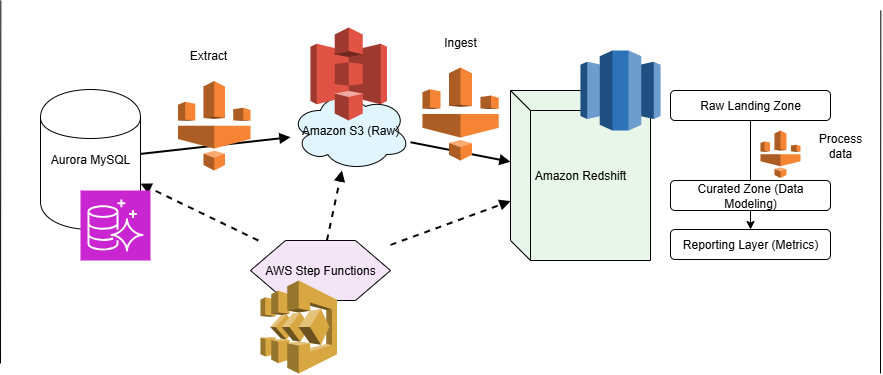
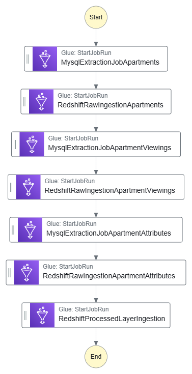
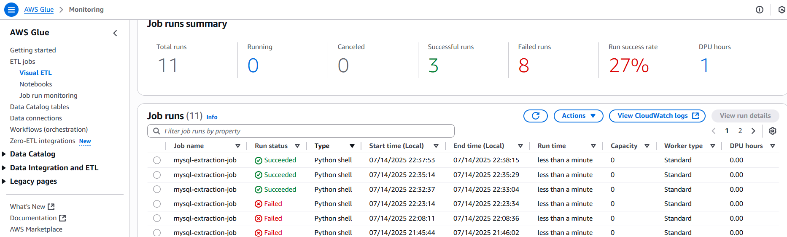
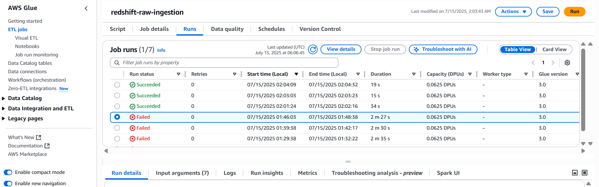

# 🏡 Rental Apartments ETL — Visual README

> **A picture‑first overview** of our Aurora → Redshift pipeline, orchestrated by AWS Step Functions and powered by AWS Glue.

---

## 1  System Architecture



---

## 2  State‑Machine Orchestration



---

## 3  Six‑Step Data Flow

|  #  | Stage          | What Happens                   | Visual                                                    |
| :-: | -------------- | ------------------------------ | --------------------------------------------------------- |
|  1  | **Extract**    | Aurora MySQL → S3 *raw*        |                |
|  2  | **Raw Ingest** | Glue COPY → Redshift *tmp*     |             |
|  3  | **Transform**  | Glue Spark → curated CSV       |         |
|  4  | **Load**       | MERGE → Redshift schemas       |                     |
|  5  | **Bookmark**   | Write latest offset → DynamoDB |          |
|  6  | **Finalize**   | Query curated tables           |  |

---

## 4  AWS Building Blocks

* **Aurora (MySQL)** – source data
* **Amazon S3** – raw & curated storage
* **AWS Glue** – Python Shell + Spark ETL
* **DynamoDB** – incremental bookmarks
* **Step Functions** – workflow engine
* **Redshift** – analytics warehouse

---

## 5  Quick Start (3 Commands)

```bash
# 1. Seed DynamoDB bookmarks
python write-to-dynamo.py

# 2. Upload Glue scripts (once)
aws s3 sync glue/ s3://<your-assets-bucket>/scripts/

# 3. Deploy Step Function
aws stepfunctions create-state-machine \
  --definition file://step-functions/step-functions.json \
  --role-arn <your-sfn-role>
```

Run the state machine in the console and watch CloudWatch Logs for progress.

---

## 6  Repo Layout

```
├─ data/                  CSV samples
├─ glue/                  Glue jobs
├─ images/                All diagrams & screenshots
├─ mysql/                 MySQL DDL / queries
├─ redshift/              Redshift DDL
├─ step-functions/        State‑machine JSON
├─ write-to-dynamo.py     Bookmark seeder
└─ README.md              (this file)
```

---

*Built with AWS Serverless & Analytics Services*
